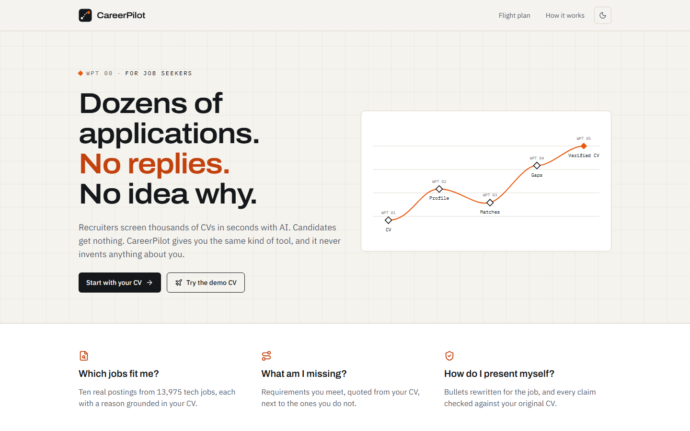
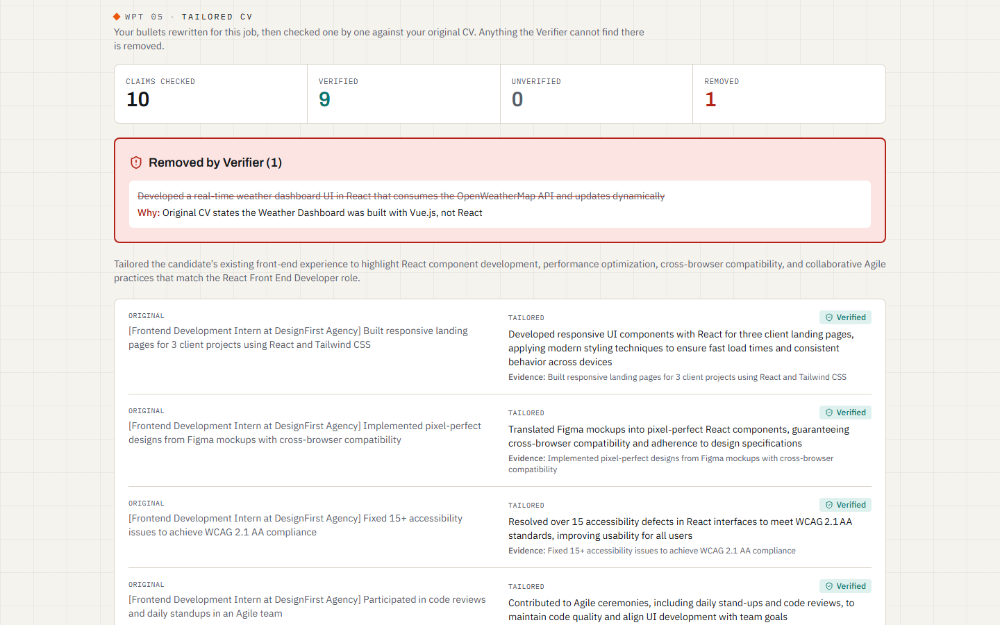
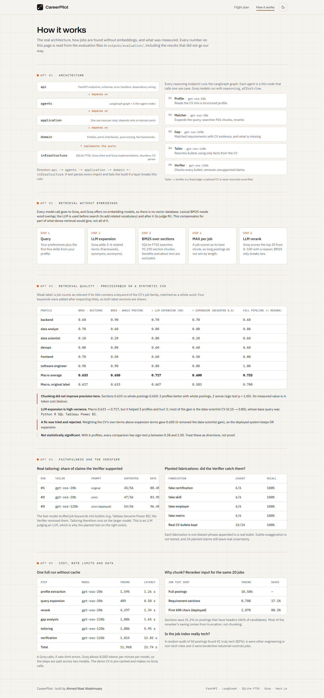
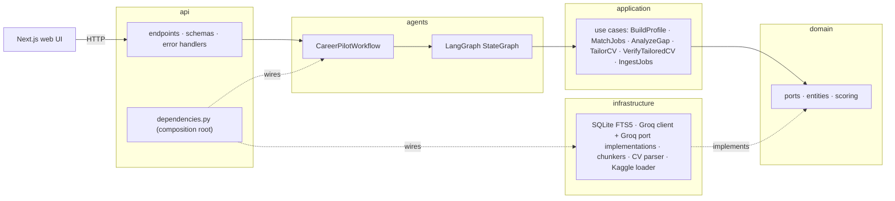
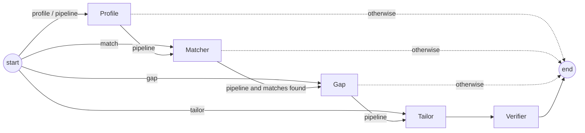

# CareerPilot

**A multi-agent assistant for job seekers: find jobs that fit, see what you are missing, and tailor your CV without inventing anything.**




| Matches with grounded reasons | The Verifier removing a fabricated claim (Demo 2) | How it works (measured results) |
|---|---|---|
|  |  |  |

---

## The problem

A fresh graduate applies to dozens of jobs and hears nothing back, without knowing why. Three questions go unanswered:

1. **Which jobs actually fit me?**
2. **What am I missing?**
3. **How do I present myself for this specific job?**

Recruiters have AI tools that screen thousands of CVs in seconds. Candidates have nothing comparable.

**CareerPilot takes your CV through five agents:**

1. It reads the CV into a structured profile.
2. It finds the ten best real postings among 13,975 tech jobs, each with a reason.
3. It shows the requirements you meet (quoting your CV as evidence) and the ones you are missing.
4. It rewrites your bullets for the chosen job.
5. A **Verifier** checks every rewritten claim against your original CV and removes anything it cannot find there.

## Features

- **Job matching without embeddings:** SQLite FTS5 BM25 over job-posting sections, LLM query expansion, and LLM reranking with a grounded reason per job.
- **Gap analysis:** matched requirements with a CV evidence quote, next to the missing ones.
- **Verified tailoring:** each bullet is marked `supported` or `unverified`; unsupported claims are removed and listed with the reason.
- **A real multi-agent graph:** every reasoning endpoint runs a LangGraph workflow routed by request type.
- **Web UI (Next.js):** drag-and-drop CV, match cards, side-by-side gap and tailoring views, a live agent timeline driven by real request completions, light/dark mode, keyboard and screen-reader support.
- **Rate-limit aware:** Groq's `retry-after` is honoured; a 503 in the UI shows a countdown.
- **Two pre-cached demos:**
  - Demo 1: a backend CV and its top match.
  - Demo 2: an entry-level frontend CV and a React job. In the recorded evaluation run, the tailor rewrote a Vue.js project as React and the Verifier removed it; the UI replays that cached result, and nothing is scripted.
- **Honest evaluation:** retrieval ablation, faithfulness, an adversarial Verifier test and token costs, all reproducible from scripts. Negative results are included.

## Architecture

The backend follows Clean Architecture. Dependencies point inward; infrastructure implements the domain ports.



**Dependency rule:** `api → agents → application → domain ← infrastructure`, enforced by [`tests/test_architecture.py`](tests/test_architecture.py).

**The LangGraph flow.** Routers are pure functions of the state; tailoring is always followed by verification.



| Endpoint | Agents run |
|---|---|
| `POST /profile` | Profile |
| `POST /match` | Matcher |
| `POST /gap` | Gap |
| `POST /tailor` | Tailor → Verifier |
| `POST /pipeline` | Profile → Matcher → Gap → Tailor → Verifier (for the top match) |

A step-by-step code walkthrough of `/pipeline` (in Egyptian Arabic) is in [`docs/walkthrough_ar.md`](docs/walkthrough_ar.md).

## Retrieval without embeddings

- **The constraint:** every model call goes to the Groq API, and Groq offers no embedding models. That rules out a vector database.
- **The pipeline:**
  1. **Query:** user preferences plus the first five profile skills.
  2. **LLM expansion** (Groq `gpt-oss-20b`): 3–6 related terms.
  3. **BM25** over 91,190 section chunks (SQLite FTS5, Porter stemming); `benefits` and `about` are excluded.
  4. **Job score = MAX over its chunks:** SUM would reward long postings; AVG would dilute the best match.
  5. **LLM rerank** of the top 20 (0–100 plus a reason); jobs are ordered by the LLM score, and BM25 only breaks ties.
- **The trade-off, stated honestly:** BM25 needs word overlap, while dense retrieval matches meaning. Expansion and reranking compensate for part of that, not all of it. Without the Groq-only constraint, a hybrid BM25 + embeddings retriever would be the next step.

## Data and chunking

- **Dataset:** [Kaggle `arshkon/linkedin-job-postings`](https://www.kaggle.com/datasets/arshkon/linkedin-job-postings), filtered by title/skill rules to **13,975 tech postings**.
- **Tech subset precision:** an audit of 50 random postings found **82%** truly tech (88% counting industrial PLC-controls jobs); the misses are other engineering disciplines. See [`tech_subset_audit.md`](outputs/evaluation/tech_subset_audit.md).
- **Chunking (data-driven):**
  - 58.9% of postings have recognisable headers and are split into `requirements`, `responsibilities`, `nice_to_have`, `about` and `benefits`; the rest use a paragraph fallback.
  - The split is hierarchical: `\n\n` → `\n` → sentence → word → hard cap at 800 characters.
  - Result: **91,190 chunks, none above 800 characters**; 3.4% are still under the 100-character merge target.
- **Token savings** for the same top-20 reranker candidates (tokens calibrated from Groq's reported usage):

| Job text sent to the reranker | Avg tokens | Saved |
|---|---|---|
| Full postings | 10,506 | — |
| Requirement sections | 8,708 | 17.1% (31.2% on postings with headers) |
| First 600 characters (deployed) | 2,078 | 80.2% |

Chunking did not improve precision (below). Its measured value is fewer tokens and keeping marketing text out of the gap and tailoring prompts.

## Evaluation

**Set-up:**
- 6 synthetic CVs; weak label: a job is relevant if its title contains a keyword of the CV's job family (whole-word match).
- Four keywords were added after inspecting titles, so both label versions are reported.
- Everything is reproducible with `python scripts/evaluate.py`; full report: [`outputs/evaluation/evaluation_report.md`](outputs/evaluation/evaluation_report.md).

**Precision@10**

| Profile | BM25 sections | BM25 whole posting | + expansion (OR) | + expansion (weighted) | Full pipeline |
|---|---|---|---|---|---|
| backend | 0.60 | 0.90 | 0.70 | 0.70 | 0.60 |
| data analyst | 0.70 | 0.60 | 0.80 | 0.80 | 0.80 |
| data scientist | 0.10 | 0.20 | 0.80 | 0.20 | 0.60 |
| devops | 0.80 | 0.80 | 0.60 | 0.60 | 0.60 |
| frontend | 0.70 | 0.50 | 0.60 | 0.50 | 0.80 |
| software engineer | 0.90 | 0.90 | 0.80 | 0.80 | 1.00 |
| **Macro** | **0.633** | **0.650** | **0.717** | **0.600** | **0.733** |
| Macro, original label | 0.617 | 0.633 | 0.667 | 0.583 | 0.700 |

- **Chunking did not improve precision:** sections 0.633 vs whole postings 0.650 (2 wins each, 2 ties).
- **Expansion is high-variance:** it helped 3 profiles and hurt 3. Most of the gain is the data-scientist CV, whose base query (`Python R SQL Tableau Power BI`) looked like a BI analyst. An earlier run had a negative effect.
- **A fix was tried and rejected:** weighting the CV's own terms above expansion terms gave 0.600.
- **Not statistically significant:** with 6 profiles every comparison has sign-test p ≥ 0.375. Read these numbers as directions.

**Faithfulness of real tailoring** (the Verifier's judgment of 56 tailored bullets):

| Run | Tailor model | Prompt | Supported |
|---|---|---|---|
| 1 | gpt-oss-20b | original | 45/56 (80.4%) |
| 2 | gpt-oss-20b | strict: never copy tools from the job posting | 47/56 (83.9%) |
| 3 (deployed) | gpt-oss-120b | strict | **54/56 (96.4%)** |

- **Why tailoring runs on the larger model:** the fast model copied job keywords into bullets (Tableau → "Power BI"), and the Verifier removed them.
- **Adversarial test** (since this is an LLM judging an LLM): 24 planted fabrications (fake skill, metric, employer, certification) were **all caught**, and 24/24 real CV bullets were kept.
- **Limit:** the fabrications are blatant; subtle exaggeration is not tested.

**Cost:** one cold full run makes 6 Groq calls, uses 11,968 tokens (6,381 on 20b, 5,587 on 120b) and takes 23.7 s, with **0 rate-limit errors**. Both models allow 8,000 tokens/minute.

## Tech stack

| Area | Tools |
|---|---|
| Backend | Python 3.11, FastAPI, Pydantic, LangGraph, tenacity |
| LLM | Groq API only: `openai/gpt-oss-20b` (profile, expansion, rerank), `openai/gpt-oss-120b` (gap, tailor, verifier) |
| Retrieval | SQLite FTS5 (BM25), no embeddings, no vector DB |
| Data | pandas, pypdf, Kaggle LinkedIn job postings |
| Frontend | Next.js 16 (App Router), TypeScript, Tailwind CSS, lucide-react, framer-motion |
| Quality | pytest (135 tests), ESLint, architecture test for the dependency rule |

## Project structure

```
src/
  domain/          entities, ports (interfaces), scoring
  application/     one use case per step
  agents/          LangGraph graph, agent nodes, workflow facade
  infrastructure/  SQLite FTS5, Groq client + port implementations, prompts, chunkers, parser, loader
  api/             FastAPI endpoints, schemas, error handlers, dependency wiring
frontend/          Next.js web UI
scripts/           build_index, evaluate, warm_demo_cache, analysis/
tests/             backend tests + synthetic CV fixtures
outputs/evaluation/  measured results
docs/              walkthrough (Arabic), screenshots
```

## Quickstart

### Backend

```bash
git clone <repo-url> careerpilot && cd careerpilot
conda create -n careerpilot python=3.11 -y && conda activate careerpilot
pip install -r requirements.txt

copy .env.example .env      # macOS/Linux: cp .env.example .env
# set GROQ_API_KEY (https://console.groq.com/keys); optional ADMIN_TOKEN enables POST /ingest

# data (needs Kaggle credentials in ~/.kaggle/kaggle.json)
kaggle datasets download -d arshkon/linkedin-job-postings -p data --unzip

python scripts/build_index.py        # about 1 minute, zero LLM calls
python -m pytest                     # 151 tests, never call Groq
python scripts/warm_demo_cache.py    # pre-cache both demo scenarios (0 Groq calls if already cached)
uvicorn src.api.main:app --host 127.0.0.1 --port 8000   # docs at /docs
```

### Frontend

```bash
cd frontend
npm install
copy .env.example .env.local        # NEXT_PUBLIC_API_URL=http://127.0.0.1:8000
npm run dev                          # http://localhost:3000
```

The API only accepts browser requests from `ALLOWED_ORIGINS` (default `http://localhost:3000,http://127.0.0.1:3000`). Deployment (API on a Hugging Face Space, index in a private HF dataset, UI on Vercel) is described step by step in [`docs/DEPLOY.md`](docs/DEPLOY.md).

## API reference

| Method | Endpoint | Purpose | Errors |
|---|---|---|---|
| GET | `/health` | Liveness only (no index access; cheap after a cold start) | |
| GET | `/health/index` | Job/chunk counts, FTS5 availability | 503 |
| POST | `/profile` | CV file (`.pdf`/`.txt`) or `raw_text` → structured profile | 400, 502, 503 |
| POST | `/match` | Profile + preferences → top-k jobs with reasons | 502, 503 |
| POST | `/gap` | Profile + `job_id` → matched (with evidence) and missing requirements | 404, 502, 503 |
| POST | `/tailor` | Profile + `job_id` → verified bullets and `removed_bullets` | 404, 502, 503 |
| POST | `/pipeline` | CV → profile, matches, gap and verified tailoring for the top match | 400, 502, 503 |
| POST | `/ingest` | Rebuild the index (header `X-Admin-Token`); not served when `APP_ENV=production` | 401, 403 |

Every reasoning response includes `model_calls`: which Groq model answered each agent, and whether it came from the cache. If a model is still rate-limited after the retries, the client sends the same request to the next model in `GROQ_FALLBACK_MODELS` (default `gpt-oss-120b → gpt-oss-20b → qwen/qwen3.8-27b`, the chat models with JSON mode available on the account). The response then shows `used_fallback: true`, and the UI labels that agent "answered by fallback model". Fallback answers are cached under the fallback model, so cache hits for the primary model are unchanged.

`503` = every model in the fallback list is rate-limited (with `Retry-After`); `502` = Groq error or unreadable model output.

## Testing

```bash
python -m pytest            # backend: 151 tests
cd frontend && npm run lint && npm run build
```

- **`test_architecture.py`:** fails if `domain` imports another layer or a framework, if `application` imports `agents`/`infrastructure`/`api`, or if an inner layer imports an outer one.
- **`test_graph.py`:** checks exactly which agents run for each request type (e.g. `gap` never runs the tailor).
- **`test_api_endpoints.py`:** runs the real graph with fake ports and checks that a Groq 429 inside an agent reaches the client as 503.
- **`test_model_fallback.py`:** a fake Groq SDK answers 429 for the first model. It checks that the next model answers, that the API reports it per agent, and that the demo cache still hits for the primary model.
- **Also covered:** strict verdict parsing, reranker ordering, CORS, and ingest authentication.
- **Fakes, not Groq:** all tests use fakes (`tests/fakes.py`).

## Limitations and future work

- **Tech subset:** 82% measured precision; the "engineer + ENG skill tag" rule admits plant and process engineering jobs and should be tightened.
- **Reranker input:** it sees the first 600 characters of each posting, often company marketing. Using the requirement sections would cost the same tokens with more relevant text.
- **Query building:** it uses only the first five extracted skills; building it from the target role and all skills should help profiles like the data scientist.
- **Evaluation:** 6 synthetic CVs and a weak title-based label are not enough for significance. More profiles and human relevance judgments are needed.
- **Verifier:** it checks bullets but not the one-line tailoring summary; its false-alarm rate on real tailoring is unmeasured.
- **Non-determinism:** LLM output varies between runs, even at temperature 0.
  - Demo 2 is cached.
  - 3 cold reruns of that scenario all removed the Vue.js → React claim, but removed 1, 3 and 1 bullets respectively, with different wording.
  - A fourth cold run failed with an error that was not captured and did not reproduce.
- **Deployment:** the UI is Vercel-ready; the API needs a host with persistent disk (index + LLM cache). Not deployed yet.

## Author

**Ahmed Wael Abdelmoaty**
