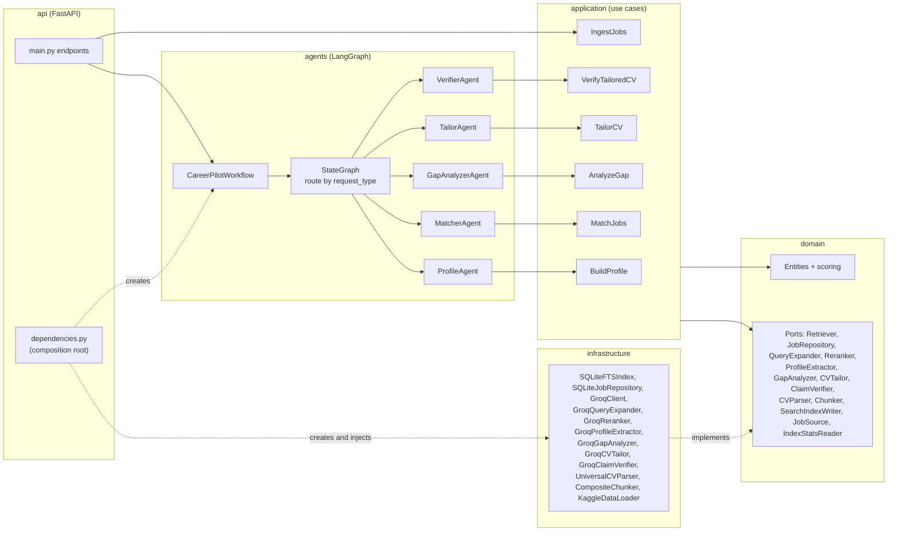

# CareerPilot

**A multi-agent RAG assistant for job seekers:** find jobs that actually fit, see what you are missing, and tailor your CV to a specific job without inventing anything.

> **Author:** Ahmed (Computer Science)

---

## 1. The story

A fresh graduate applies to dozens of jobs and hears nothing back, without knowing why. Three questions go unanswered:

1. *Which jobs actually fit me?*
2. *What am I missing for this job?*
3. *How do I present myself for this specific job?*

Recruiters have AI tools that screen thousands of CVs in seconds. Candidates have nothing comparable. CareerPilot gives the candidate that power.

**Flow:** upload CV → structured profile → top-10 real matching jobs with reasons → gap report (requirements you meet, with evidence quoted from your CV, and the ones you are missing) → tailored CV bullets that only use facts from your original CV → claim-by-claim verification. Unsupported claims are removed.

**Data:** 13,975 tech job postings from Kaggle (`arshkon/linkedin-job-postings`), filtered from the full LinkedIn dataset by title/skill rules. An audited random sample is 82% truly tech (section 10).

---

## 2. Architecture

### 2.1 Layers and the dependency rule

```
api  ->  agents  ->  application  ->  domain  <-  infrastructure
```

| Layer | Contents | May import |
|---|---|---|
| `src/domain` | Entities, exceptions, ports (ABCs), pure scoring (`scoring.py`) | standard library only |
| `src/application` | Use cases (`BuildProfile`, `MatchJobs`, `AnalyzeGap`, `TailorCV`, `VerifyTailoredCV`, `IngestJobs`) | `domain` only |
| `src/agents` | LangGraph nodes (one per step), `graph.py` (routing), `workflow.py` (typed facade) | `application`, `domain` |
| `src/infrastructure` | SQLite FTS5 index, Groq client, Groq implementations of the ports, prompts, chunkers, CV parser, Kaggle loader | `domain` |
| `src/api` | FastAPI endpoints, schemas, error handlers, `dependencies.py` (composition root) | everything (it wires the app) |

`tests/test_architecture.py` parses every import in `src/` and **fails the build** if `domain` imports another layer or a framework, if `application` imports `agents`/`infrastructure`/`api`, or if `agents` or `infrastructure` import an outer layer.



### 2.2 The multi-agent graph (used by every reasoning endpoint)

| Endpoint | `request_type` | Agents run |
|---|---|---|
| `POST /profile` | `profile` | ProfileAgent |
| `POST /match` | `match` | MatcherAgent |
| `POST /gap` | `gap` | GapAnalyzerAgent |
| `POST /tailor` | `tailor` | TailorAgent → VerifierAgent |
| `POST /pipeline` | `pipeline` | ProfileAgent → MatcherAgent → GapAnalyzerAgent → TailorAgent → VerifierAgent (on the top match; stops after matching if nothing matched) |

Routers are pure functions of the state (they never modify it). Tailoring is always followed by verification (a fixed edge), so unverified bullets cannot be returned. `tests/test_graph.py` checks the exact set of agents each request type runs (for example, `gap` never runs the tailor or verifier).

Each agent is a thin node: it reads its inputs from the state, calls one use case, and returns only the keys it produced. Errors are **not** swallowed: a Groq rate limit inside any node reaches the API as `503` with `Retry-After`, unparseable LLM output as `502`, and an unknown job as `404`.

---

## 3. Retrieval without embeddings

**Hard constraint:** every model call goes to the Groq API, and Groq offers no embedding models. Adding another provider or running a local embedding model is out of scope by design. So CareerPilot uses lexical retrieval and uses the LLM where it helps most:

1. **Query:** built from the user's preferences plus the first five profile skills.
2. **Query expansion (Groq, fast model):** 3–6 related terms (frameworks, synonyms, acronyms).
3. **BM25 over section chunks (SQLite FTS5, Porter stemming):** `benefits` and `about` chunks are excluded; unlabelled (`full`) chunks stay searchable.
4. **Job score = MAX over its chunks:** a long posting with many weak chunks cannot outrank a short one with one strong requirements chunk (SUM would add length bias, AVG would dilute the strongest match).
5. **Parent-document fetch:** the full postings of the top jobs are loaded.
6. **LLM rerank (Groq, fast model):** the top 20 are scored 0–100 with a one-sentence reason. Jobs are ordered by the LLM score; BM25 only breaks ties. BM25 and LLM scores are never mixed on one scale.

### Why no vector database? (honest version)

- **The real reason is the constraint:** Groq-only, and Groq has no embeddings.
- **What we lose:** dense retrieval matches meaning ("built REST services" ≈ "API development") even when the words differ. BM25 needs word overlap.
- **How we compensate:** LLM query expansion adds related vocabulary before search, and LLM reranking judges semantic fit after it.
- **What we measured:** expansion helps some profiles and hurts others (section 6). It is not a full substitute for semantic retrieval. With embeddings available, a hybrid (BM25 + dense) retriever would be the natural next step.
- **Side benefits of the choice:** no embedding index to build (the index builds with zero LLM calls), and BM25 scores are easy to inspect.

---

## 4. Data-driven chunking

- **Data:** 13,975 tech postings (median description 3,130 characters; 91.1% contain line breaks).
- **Headers:** 58.9% of postings have at least one recognisable section header (measured by `scripts/eda_chunking.py`). These are split into `requirements`, `responsibilities`, `nice_to_have`, `about` and `benefits`. The other 41.1% use a paragraph fallback labelled `full`.
- **Hierarchical split:** `\n\n` → `\n` → sentence → word → hard cap at **800 characters**. The section label is kept on every piece.
- **Result:** 91,190 chunks, **0 above 800 characters**. Fragments under 100 characters are merged into a neighbour of the same label when the merge fits under 800. **3.37% of chunks (3,069) are still under 100 characters**, because a merge would exceed the cap or there was no neighbour.
- **Index:** SQLite FTS5 external-content table. The last rebuild (`scripts/build_index.py`, CSV loading included) took **66.3 s**, produced a **174.0 MB** database, and made zero LLM calls.


### 4.1 Why chunk if precision is equal? Measured token savings

For the same top-20 candidates the reranker receives, on each of the 6 evaluation profiles (`scripts/analysis/chunking_token_savings.py`, output `outputs/evaluation/chunking_token_savings.json`):

**Method:** a 20-job prompt of full postings is about 10.5K tokens, which exceeds Groq's 8,000 tokens/minute limit in a single request. So characters were counted exactly and converted to tokens with a chars-per-token ratio calibrated from Groq's reported `usage.prompt_tokens` on 8 real postings (5.66 chars/token for full text, 5.54 for sections).

| Job text sent to the reranker (20 jobs) | Avg job-text tokens | Saved vs full |
|---|---|---|
| Full postings (no chunking) | 10,506 | — |
| Requirement sections only (chunking) | 8,708 | **17.1%** |
| First 600 characters (deployed reranker) | 2,078 | 80.2% |

- **Savings from sections:** only 45.8% of the candidates have recognisable headers (the rest fall back to full text). On those postings, sections save **31.2%**.
- **Honest answer:**
  - Chunking gives a moderate token saving (17% overall, 31% where headers exist) and keeps benefits/about marketing out of the gap and tailoring prompts, which use sections.
  - Most of the reranker's own saving comes from truncation, not chunking.
  - Full postings would not fit in one request under the rate limit at all.
- **Possible improvement (not implemented):** the deployed reranker's first 600 characters are often "About us" text. Taking the 600 characters from the requirement sections would cost the same tokens with more relevant content.

---

## 5. Agents and anti-fabrication

| Agent | Use case | Model (Groq) |
|---|---|---|
| ProfileAgent | CV (PDF/text) → structured profile | `openai/gpt-oss-20b` |
| MatcherAgent | expansion → BM25 → MAX → rerank | `openai/gpt-oss-20b` |
| GapAnalyzerAgent | matched requirements with CV evidence + missing ones | `openai/gpt-oss-120b` |
| TailorAgent | rewrite bullets for the job, using CV facts only | `openai/gpt-oss-120b` |
| VerifierAgent | check every tailored bullet against the original CV text | `openai/gpt-oss-120b` |

**Verification:**
- Bullets are numbered; the verifier returns `{bullet_id, verdict, evidence}`.
- Verdicts are parsed strictly: only the exact strings `"supported"` or `"unsupported"` are accepted.
- A missing or malformed verdict becomes `unverified`, never `supported`.
- Unsupported bullets are **removed** from `bullets` and returned separately in `removed_bullets`, with the reason.

The previous version had a bug here: it checked `"supp" in verdict`, which matched "unsupported", so every rejected claim was counted as supported.

---

## 6. Evaluation (measured, `scripts/evaluate.py`)

Full generated report: [`outputs/evaluation/evaluation_report.md`](outputs/evaluation/evaluation_report.md). Raw data: `evaluation_results.json`. Earlier runs: `outputs/evaluation/runs/`.

**Set-up:**
- 6 synthetic CVs (`tests/fixtures/`): backend, data analyst, data scientist, devops, frontend (entry level), software engineer.
- Weak relevance label: a retrieved job is relevant if its title contains a keyword of the profile's job family, matched as a whole word (so "ml" does not match "html").
- Four keywords were added **after** inspecting retrieved titles: `scientist`; `reactjs`, `react.js`, `user interface`. Both label versions are reported.

### 6.1 Retrieval, Precision@10

| Profile | BM25 sections | BM25 whole posting | + expansion (OR) | + expansion (weighted 0.5) | Full pipeline (expansion + rerank) |
|---|---|---|---|---|---|
| backend | 0.60 | 0.90 | 0.70 | 0.70 | 0.60 |
| data_analyst | 0.70 | 0.60 | 0.80 | 0.80 | 0.80 |
| data_scientist | 0.10 | 0.20 | 0.80 | 0.20 | 0.60 |
| devops | 0.80 | 0.80 | 0.60 | 0.60 | 0.60 |
| frontend | 0.70 | 0.50 | 0.60 | 0.50 | 0.80 |
| software_engineer | 0.90 | 0.90 | 0.80 | 0.80 | 1.00 |
| **Macro average** | **0.633** | **0.650** | **0.717** | **0.600** | **0.733** |
| Macro, original label | 0.617 | 0.633 | 0.667 | 0.583 | 0.700 |

"Whole posting" is a fair baseline: the same 13,975 postings, one chunk per posting, the same query and the same pipeline stage (BM25 only, job-level dedup).

**What the numbers show:**
- **Chunking:** sections (0.633) vs whole postings (0.650) are **effectively equal**. Whole postings win on 2 profiles, sections on 2, and 2 tie. With this label, section chunking did **not** improve Precision@10. Its measured value is in the prompts: 17% fewer reranker job-text tokens (31% on postings with headers), and no benefits/about text in the gap and tailoring prompts (section 4.1).
- **Expansion (OR):** 0.633 → 0.717 on average, but this comes almost entirely from data_scientist (0.10 → 0.80). It improves 3 profiles and hurts 3 (devops −0.2, frontend −0.1, software engineer −0.1). With the old run's expansions the macro effect was negative (0.64 → 0.62). **Expansion is high-variance, not a reliable gain.**
- **Why expansion helps or hurts:**
  - It rescues data_scientist: the base query (from the first five skills) is `Python R SQL Tableau Power BI`, which reads like a BI analyst. The expansion adds `NumPy`, `Scikit-learn`, which pulls in data-science jobs.
  - It hurts frontend: `Next.js`, `Redux`, `GraphQL` pull in generic "Software Engineer" titles. All terms are ORed with equal weight, so expansion terms can dominate (query drift).
- **The fix we tried:** weighting the original terms higher (`score = original + 0.5 × expansion`; the weight was chosen before seeing results, not tuned). It made expansion almost inert: 0.600 macro, and it removed the data_scientist gain. **Rejected;** the deployed system keeps OR expansion.
- **data_scientist investigation:** the label was only slightly too narrow (adding `scientist` changes one title). The main cause of 0.0–0.1 is the query built from the first five skills. The CV itself also says it seeks "data analytics and machine learning" roles, so analyst jobs are arguably relevant, which a single-family label cannot express.
- **Rerank:** full pipeline 0.733 vs expansion-only 0.717. Up on 2 profiles, down on 2.
- **Significance:** with 6 profiles none of these differences is statistically significant. A paired sign test gives p ≥ 0.375 for every comparison. The weak label is also noisy: duplicate reposts and single-family labels affect it.

### 6.2 Faithfulness of real tailoring

For each profile, the top job from the full pipeline was tailored and every bullet verified. We changed one variable per run:

| Run | Tailor model | Tailor prompt | Supported / claims | Rate |
|---|---|---|---|---|
| 1 | gpt-oss-20b | original | 45 / 56 | 0.804 |
| 2 | gpt-oss-20b | + "never copy a tool from the job posting into a bullet" | 47 / 56 | 0.839 |
| 3 (deployed) | gpt-oss-120b | + same rule | **54 / 56** | **0.964** |

- **Why the fast model was rejected for tailoring:** it stuffed job keywords into bullets (Tableau → "Power BI", a Go pipeline → "Java-based", a Vue.js project → "React"). The verifier caught all of these and removed them.
- **The 2 claims removed in run 3:** "Weather dashboard in React" (the CV says Vue.js) and "delivering insights to senior stakeholders" (not in the CV).
- **For comparison:** the previous version reported 100%, but with its verdict-parsing bug. The raw verdicts in the old cache show 34/38 = 89.5%.
- **Caveat:** this is an LLM judging an LLM. Some removals in run 2 were embellishments ("clean, maintainable code") rather than invented facts. We have no human labels to measure the verifier's false alarms on real tailoring.

### 6.3 Adversarial verifier test (not circular)

**Set-up:** for each CV, 4 verbatim bullets (controls) are mixed with 4 bullets that each carry one planted fabrication:
- a fake skill ("using Rust and Elixir")
- a fake metric ("cutting infrastructure costs by 73%")
- a fake employer ("while on contract at Goldman Sachs")
- a fake certification ("Google Professional Cloud Architect")

Each fabrication is checked to be absent from that CV.

| Fabrication type | Caught | Planted | Recall |
|---|---|---|---|
| fake skill | 6 | 6 | 1.0 |
| fake metric | 6 | 6 | 1.0 |
| fake employer | 6 | 6 | 1.0 |
| fake certification | 6 | 6 | 1.0 |
| **All** | **24** | **24** | **1.0** |

Controls judged supported: 24/24 (0 false alarms).

**Limits:** these fabrications are blatant, one appended phrase each. Subtle exaggeration (e.g., "led" instead of "participated") is not tested. With 24 planted claims, 100% recall still leaves real uncertainty; a 95% confidence interval would reach down to about 86%.

---

## 7. Demo safety (Groq rate limits)

- **Limit:** both models have **8,000 tokens/minute** each (read from Groq's `x-ratelimit-limit-tokens` header). The limit is per model, so the steps are split across the two models.
- **Token reduction:**
  - `reasoning_effort=low` for the gpt-oss models (they spend completion tokens on hidden reasoning).
  - Gap analysis and tailoring receive only the requirement-bearing sections of the posting, not the full text.
- **Retries:** on a 429 the client waits as long as Groq's `retry-after` header says, instead of a short fixed backoff.

**One cold full pipeline** (`scripts/warm_demo_cache.py` with an empty cache):

| Step | Model | Tokens | Live latency |
|---|---|---|---|
| profile extraction | 20b | 1,595 | 1.3 s |
| query expansion | 20b | 489 | 0.6 s |
| rerank | 20b | 4,297 | 1.3 s |
| gap analysis | 120b | 1,886 | 1.7 s |
| tailoring | 120b | 1,886 | 6.0 s |
| verification | 120b | 1,815 | 12.8 s |
| **Total** | | **11,968** (20b 6,381 · 120b 5,587) | **23.7 s wall** |

- **One pipeline per minute fits both limits, with 0 × 429.** The previous version's evaluation logged 22.5K tokens for tailor + verify across 4 profiles (about 5.6K per profile); it is now about 3.7K.
- **Two cold pipelines within one minute would exceed the 20b budget.** The client would then wait for the window; it would not fail.
- **Demo procedure:** run `python scripts/warm_demo_cache.py` before the demo. After that, `/pipeline`, `/profile`, `/match`, `/gap` and `/tailor` for the demo CV made **0 Groq calls** (verified through the real API: 12 cache hits, 0 calls).
- **Caveat:** a *different* CV during the demo makes live calls.

---

## 8. Running it

```bash
conda activate careerpilot                  # Python 3.11
pip install -r requirements.txt
cp .env.example .env                        # set GROQ_API_KEY (and ADMIN_TOKEN to enable /ingest)
python scripts/build_index.py               # zero LLM calls
python -m pytest                            # 130 tests, never call Groq
python scripts/warm_demo_cache.py           # before a demo
uvicorn src.api.main:app --host 127.0.0.1 --port 8000
```

| Method | Endpoint | Purpose | Errors |
|---|---|---|---|
| GET | `/health` | job/chunk counts, FTS5 availability | |
| POST | `/profile` | CV file (`.pdf`/`.txt`) or `raw_text` → profile | 400, 502, 503 |
| POST | `/match` | profile + preferences → top-k jobs with reasons | 502, 503 |
| POST | `/gap` | profile + `job_id` → matched (with evidence) / missing | 404, 502, 503 |
| POST | `/tailor` | profile + `job_id` → verified bullets + `removed_bullets` | 404, 502, 503 |
| POST | `/pipeline` | CV → profile, matches, gap and verified tailoring for the top match | 400, 502, 503 |
| POST | `/ingest` | rebuild index; requires header `X-Admin-Token` = `ADMIN_TOKEN` | 401, 403 |

`503` = Groq rate limit after retries (with `Retry-After`), `502` = Groq error or unparseable output.

---

## 9. OOP and SOLID in the code

| Principle | Where |
|---|---|
| Abstraction / polymorphism | Ports in `domain/interfaces.py`; `BaseAgent.run(state)` implemented by five agents and invoked uniformly by LangGraph; `Chunker.chunk()` (section / paragraph / composite / whole-posting in the evaluation) |
| Encapsulation | Entities validate their own invariants; `TailoredCV.apply_verification` is the only way unsupported bullets are removed |
| Inheritance | `CareerPilotError` hierarchy (mapped to HTTP codes in `api/error_handlers.py`); agents extend `BaseAgent` |
| S | Each use case does one job; prompts live next to the Groq implementation that uses them |
| O | New chunkers register in `ChunkerFactory`; a new LLM provider would be a new port implementation, with no use-case changes |
| L | `tests/fakes.py` substitutes every port; use cases and the graph run unchanged on fakes |
| I | `Retriever` (read) vs `SearchIndexWriter` (write) vs `JobRepository` vs `IndexStatsReader` |
| D | Use cases receive ports; only `api/dependencies.py` and scripts create concrete classes. This is enforced by `tests/test_architecture.py` |

---

## 10. Known limitations

- **Evaluation size:** 6 synthetic CVs and a weak title-family label. There are no human relevance judgments, and the differences are not significant.
- **Query:** it uses only the first five extracted skills, and extraction order depends on the LLM. With a cold cache the demo CV's top match changed between runs (LLM outputs are not fully deterministic at temperature 0).
- **Verification scope:** the verifier checks bullets, not the one-line tailoring summary. It is itself an LLM, so its false-alarm rate on real tailoring is unmeasured.
- **Data:** the dataset contains reposted duplicates, so the same title can appear twice in a top-10.
- **Tech-subset precision:** a fresh random audit (50 postings, seed 42, one annotator) gives **82%** (41/50), or 88% if industrial PLC-controls jobs count as tech. That is lower than the previous tool's 94%. The errors are non-software engineering jobs (boilers, plant instrumentation, photonics, solid waste) and one apparel role. Details: [`outputs/evaluation/tech_subset_audit.md`](outputs/evaluation/tech_subset_audit.md).
